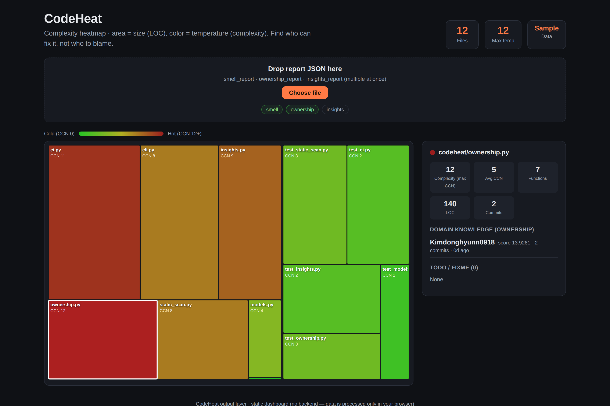

# CodeHeat 🔥

> **Static analysis meets git history — so you refactor the files that actually hurt, and ask the people who actually know.**

CodeHeat finds the files that slow your team down, ranks them by how much they hurt, and tells you **who can fix them** — without ever sending your code to an LLM.

<p align="center"><em>📹 Demo GIF coming soon — record a scan → dashboard flow and drop it at <code>docs/demo.gif</code>, then uncomment below.</em></p>
<!-- <p align="center"></p> -->

<p align="center">
  <a href="#install">Install</a> ·
  <a href="#why-codeheat">Why</a> ·
  <a href="#how-it-compares">Compare</a> ·
  <a href="#features">Features</a> ·
  <a href="#architecture">Architecture</a>
</p>

---

## Why CodeHeat

You clone a repo with 500 files. Where do you even start?

```
        ┌─────────────┐
        │ Repository  │
        │  500 files  │
        └──────┬──────┘
               │
               ▼
   "Which file do I fix first?"
   "Who knows this code best?"
               │
               ▼
        ┌─────────────┐
        │  CodeHeat   │
        └──────┬──────┘
               │
               ▼
   ① Ranked refactor list (by complexity + churn + TODO age)
   ② The domain expert to ask  (matching, not blame)
   ③ AI insights               (metadata only — your code never leaves)
```

The core philosophy is two things:

- **Matching, not blame.** CodeHeat doesn't ask *"who broke this?"* — it asks *"who can fix this fastest?"* by finding the contributor with the most domain knowledge of each hotspot.
- **Your code stays yours.** The AI layer receives **numbers and metadata only — never source code.** The JSON output is structured from day one with this constraint in mind. Safe for private and enterprise repos.

## How it compares

| | Complexity hotspots | Ownership / who-to-ask | AI prioritization | Code never sent to LLM | Open source |
|---|:---:|:---:|:---:|:---:|:---:|
| **SonarQube**  | ✅ | ❌ | ◐ | ✅ | ◐ (Community) |
| **CodeScene**  | ✅ | ✅ | ❌ | ✅ | ❌ |
| **CodeHeat**   | ✅ | ✅ | ✅ | ✅ | ✅ |

CodeHeat's distinctive combination: **ownership matching + AI prioritization that runs on metadata alone**, fully open source.

## Install

```bash
pip install -e .
```

Requires [`lizard`](https://github.com/terryyin/lizard) (multi-language complexity analysis); TODO-age calculation needs `git`.

## Quick start

```bash
# 1. Scan: complexity + TODO/FIXME + TODO age
codeheat scan <repo_path> --output smell_report.json

# 2. Ownership: who has domain knowledge of each hotspot
codeheat own <repo_path> --from-report smell_report.json

# 3. AI insights: refactor priority + who-to-ask (metadata only)
codeheat insights smell_report.json --ownership-report ownership_report.json
```

You can also run it as a module: `python -m codeheat.cli scan <repo_path>`.

## Features

### 🔍 Static scan — `codeheat scan`

Complexity (max CCN per file), function count, LOC, and TODO/FIXME markers with their **age in days** (from `git log -S`).

```bash
codeheat scan <repo_path> --output report.json
codeheat scan <repo_path> --no-todo-age   # skip git history for speed on large repos
```

TODO detection is **token-based**: Pygments tokenizes the source and only real comment tokens are inspected for markers, so docstring prose, regex literals, argument names, and fake comments inside string literals (`s = "# TODO"`) are all excluded. A line-anchored regex fallback (which still masks single-line string literals) kicks in when Pygments can't find a lexer.

### 👤 Ownership — `codeheat own`

Weights each contributor by *"who committed when complexity spiked"* to surface the person with the most domain knowledge. **This is matching, not blame.**

```bash
codeheat own <repo_path> --from-report smell_report.json   # follow stage-1 priority
codeheat own <repo_path> --top 2 --limit 30                # all tracked files, top N people
codeheat own <repo_path> --churn-only                      # skip complexity delta, weight by churn (faster)
```

Score = Σ(recency weight × change-magnitude weight). Recency decays with a 1-year half-life; change magnitude is the complexity delta that commit introduced (falls back to churn when delta isn't computable). Contributors are aggregated by email (`%aE`, `.mailmap`-aware); merge commits are excluded.

### 🤖 AI insights — `codeheat insights`

Bundles the stage 1+2 JSON, hands it to an LLM, and gets back a refactor priority and *"ask who, about what"* per file. **Source code is never sent — only numbers and metadata.**

```bash
# Free local backend (Ollama). Run `ollama pull llama3.1` first.
codeheat insights smell_report.json --ownership-report ownership_report.json

codeheat insights smell_report.json --backend ollama --model llama3.1:8b --top-k 10
codeheat insights smell_report.json --backend anthropic   # needs pip install codeheat[llm] + ANTHROPIC_API_KEY
codeheat insights smell_report.json --dry-run             # print the prompt only, no LLM call
```

The `ollama` backend is stdlib-only (zero extra deps); the `anthropic` backend uses `claude-opus-4-8` with structured output to strictly enforce the schema. Output: `insights_report.json` (per-file risk/reason/ask_who/ask_what + overall summary).

### 🤖 GitHub Action PR bot — `python -m codeheat.ci pr-comment`

For every file a PR touches, it tables how the **heatmap temperature (max CCN)** changed from base→head, and next to files that got hotter it shows **the person to ask if you get stuck** (top ownership contributor — matching, not blame).

```bash
python -m codeheat.ci pr-comment --base main --head HEAD --no-post              # preview comment body
python -m codeheat.ci pr-comment --base main --head HEAD --no-post --churn-only # faster (churn-based)
```

`.github/workflows/codeheat.yml` runs it on every `pull_request` event. It reads PR context from the event payload + `GITHUB_*` env vars, comments with `GITHUB_TOKEN`, and **upserts via a hidden marker** so repeated pushes update one comment instead of spamming. Comment posting uses stdlib `urllib` only (zero extra deps).

```yaml
on:
  pull_request:
    types: [opened, synchronize, reopened]
permissions:
  contents: read
  pull-requests: write
# checkout must use fetch-depth: 0 (base...head delta needs full history)
```

### 📊 Dashboard — D3 treemap heatmap (`dashboard/`)

<p align="center"></p>

View the exported report as a **treemap heatmap**: area = file size (LOC), color = complexity temperature (max CCN). Click a file to see complexity, TODOs, the domain-knowledge holder, and the AI insight in a side panel. It's a backendless static site (`output: "export"`) — data is processed only in the browser.

```bash
cd dashboard
npm install
npm run dev     # http://localhost:3000
npm run build   # static site in out/  (deploy to Vercel / GitHub Pages)
```

It opens with a sample bundle built from this repo; drop your own `smell_report.json` (+ ownership/insights) on the dropzone to replace it. See [`dashboard/README.md`](dashboard/README.md).

### 🧩 VS Code extension (`vscode-extension/`)

<!-- Screenshot: capture the 🔥 sidebar + status bar, save to docs/vscode.png, then uncomment.
<p align="center"></p> -->

The complexity heatmap inside your editor. The sidebar 🔥 view lists files by temperature (hot files = red flames); click to open, hover for owner/risk/TODO. The status bar shows `🔥 CCN N · owner` for the current file. It reads report JSON from the workspace root, or runs the CLI via the "Scan workspace" button.

```bash
cd vscode-extension
npm install
npm run compile   # then open the folder in VS Code and press F5 (Extension Development Host)
```

See [`vscode-extension/README.md`](vscode-extension/README.md).

## Architecture

```
┌──────────┐   ┌──────────────┐   ┌────────────────┐   ┌──────────────────────┐
│  scan    │ → │     own      │ → │   insights     │ → │  Output layers       │
│ lizard + │   │  git history │   │  LLM (metadata │   │  • PR bot (Actions)  │
│ pygments │   │   ownership  │   │   only)        │   │  • D3 dashboard      │
└──────────┘   └──────────────┘   └────────────────┘   │  • VS Code extension │
   JSON            JSON               JSON              └──────────────────────┘
```

Each stage emits JSON that the next consumes. The pipeline is structured so the LLM layer only ever sees **numbers and metadata, never code**.

### Output (`smell_report.json`)

Sorted by complexity (max CCN per file), descending:

```json
{
  "repo_path": ".",
  "file_count": 3,
  "files": [
    {
      "file": "codeheat/static_scan.py",
      "complexity": 6,
      "avg_complexity": 2.5,
      "function_count": 7,
      "loc": 90,
      "todos": [{ "line": 42, "text": "TODO: ...", "age_days": 3 }],
      "duplication_ratio": 0.0,
      "oldest_todo_days": 3
    }
  ]
}
```

## Known limitations

**Scan**
- TODO detection is token-based; the regex fallback's only blind spot is fake comments inside *multi-line* string literals (mainstream languages take the Pygments path and aren't affected).
- `duplication_ratio` is computed per function; `git log -S` (pickaxe) uses only the first 40 chars of the TODO text, so very generic text may mismatch. `age_days` is `null` when git is unavailable/times out/file untracked.
- `exclude` is directory-level only (node_modules/.git/venv/.venv) plus build outputs (.next/out/dist/build).

**Ownership**
- Complexity delta is measured at file-level max CCN, so a commit can be weighted even if it didn't touch the function that's complex (function-level matching is on the roadmap).
- Delta calc runs one `git show` per commit (in-memory, no temp files), but files with very many commits can still be slow — use `--churn-only` or `--limit`.

**PR bot**
- Temperature is file-level max CCN, so splitting a function may not lower it if another function is more complex. Non-code files (.md/.json/.toml) are excluded. A brand-new file shows "🆕 new" instead of a delta. Needs `fetch-depth: 0` for accurate `base...head` deltas.

## Roadmap

Function-level ownership · auto-created GitHub Issues · Slack/Discord alerts · **MCP server** (so AI coding tools can query *"the riskiest file right now"* or *"who knows this code best"* directly) · SARIF output · tree-sitter-based precise analysis.

## License

MIT
